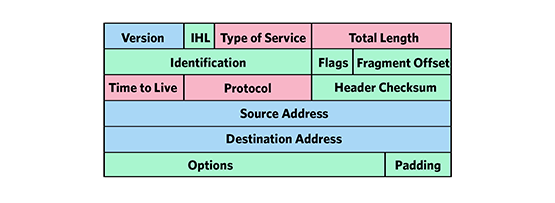
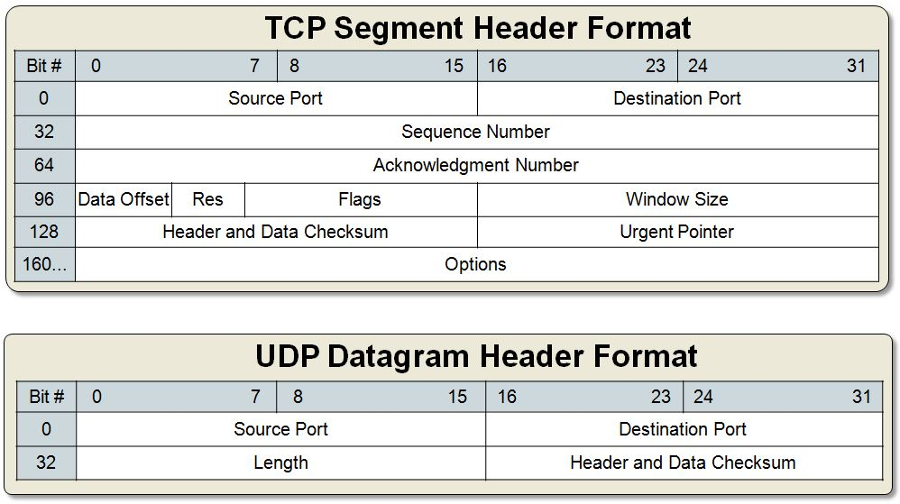

# Packet Capture utility
Capture packets from the IP stack
---
This app will capture packets from the IP/TCP/UDP stack and log them. 

The packet header information and data will be processed and presented in user readable format.

If the protocol is well known the IP/TCP/UDP information and data will be processed and presented in user readable format.

If application type is in the supported list, the app will decode the data for store.

[ ] Define the supported application types
